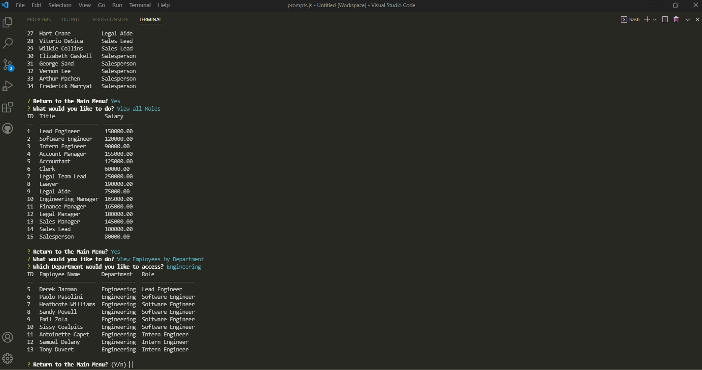

# employee-tracker

 
 
## Description 
 
  * With this application, you can view your employees, roles, and departments.  As well as, update the employee's role.  You can also add and delete departments, employees, and roles.
 
## Installation
  
  * Download this repository
  * Create a .env file in the root folder of the downloaded repository with DB_NAME='employee_tracker', DB_USER='Your personal MYSQL username', DB_PW='Your personal MYSQL password'.
  * Install NODE.js, if you don't have it installed.  Run the command `npm install`, to get the NODE modules you will need for this application.
  * Use the command line to open MySQL using `mysql -u root -p`, then enter your MySQL password and run the commands, `source db/db.sql`, `source db/schema.sql`, and `source db/seeds.sql` to load some information into the tables.
  * Run `node server` or `npm start` in git bash to start the application, then follow the prompts and questions.

## Images

 
## License

  

  * This project is covered under [MIT](https://choosealicense.com/licenses/mit/)

## Questions?

  * Contact me at: CMJensen82@gmail.com
  * Github: https://github.com/craigmjensen/
